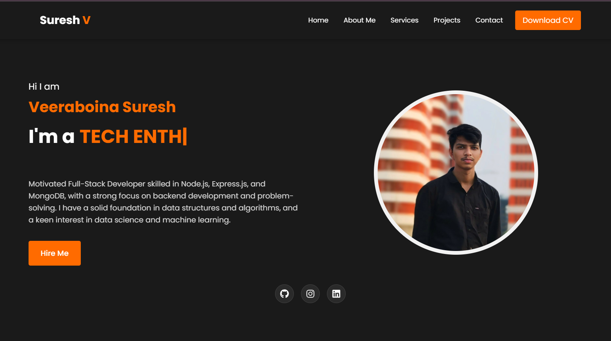

# Veeraboina Suresh - Portfolio

A modern, responsive portfolio website built with React and Vite, showcasing my skills, projects, and experience as a MERN Stack Developer.



## 🌟 Features

- **Responsive Design**: Looks great on all devices - mobile, tablet, and desktop
- **Dark Theme**: Modern dark theme with orange accents for better readability
- **Animated Sections**: Smooth animations when scrolling through different sections
- **Dynamic Typing Effect**: Showcases multiple professional titles with a typing animation
- **Project Showcase**: Filterable projects section to display my work
- **Contact Form**: Interactive form for visitors to get in touch
- **Skills Visualization**: Visual representation of technical skills with progress bars
- **Education Timeline**: Chronological display of educational background

## 🛠️ Technologies Used

- **React**: Frontend library for building the user interface
- **Vite**: Next-generation frontend tooling for faster development
- **CSS3**: Custom styling with modern CSS features
- **AOS (Animate On Scroll)**: Library for scroll animations
- **React Icons**: Icon library for social media and UI elements
- **Typed.js**: Library for the typing animation effect

## 📋 Sections

1. **Home**: Introduction with a typing animation showcasing my roles
2. **About**: Personal information and professional summary
3. **Skills**: Technical skills categorized by area of expertise
4. **Education**: Academic background and qualifications
5. **Projects**: Showcase of my development projects with filtering options
6. **Contact**: Contact form and information

## 🔧 Project Structure

```
my-portfolio/
├── public/
├── src/
│   ├── assets/
│   │   └── images/
│   ├── components/
│   │   ├── About.jsx
│   │   ├── Contact.jsx
│   │   ├── Education.jsx
│   │   ├── Footer.jsx
│   │   ├── Hero.jsx
│   │   ├── Navbar.jsx
│   │   ├── Projects.jsx
│   │   └── Skills.jsx
│   ├── styles/
│   │   ├── About.css
│   │   ├── Contact.css
│   │   ├── Education.css
│   │   ├── Footer.css
│   │   ├── Hero.css
│   │   ├── Navbar.css
│   │   ├── Projects.css
│   │   └── Skills.css
│   ├── utils/
│   ├── App.css
│   ├── App.jsx
│   ├── index.css
│   └── main.jsx
├── .gitignore
├── eslint.config.js
├── index.html
├── package.json
├── README.md
└── vite.config.js
```

## 🚀 Getting Started

### Prerequisites

- Node.js (v14 or higher)
- npm or yarn

### Installation

1. Clone the repository
   ```bash
   git clone https://github.com/suresh1319/portfolio.git
   cd portfolio
   ```

2. Install dependencies
   ```bash
   npm install
   ```

3. Start the development server
   ```bash
   npm run dev
   ```

4. Open your browser and navigate to `http://localhost:5173`

## 📦 Building for Production

```bash
npm run build
```

This will create a `dist` folder with the production-ready files.

## 🔍 Featured Projects

1. **SnapStudy**: AI-powered application for generating comprehensive study materials
2. **Pure Care Fitness**: Full-stack fitness management web application
3. **Image Generator**: MERN stack application for generating images via AI

## 📞 Contact

- **Email**: sureshyadav6114@gmail.com
- **GitHub**: [github.com/suresh1319](https://github.com/suresh1319)
- **LinkedIn**: [linkedin.com/in/suresh-yadav1319](https://www.linkedin.com/in/suresh-yadav1319/)
- **Twitter**: [twitter.com/veeraboinasuresh](https://twitter.com/veeraboinasuresh)

## 📄 License

This project is open source and available under the [MIT License](LICENSE).

---

Designed and developed by Veeraboina Suresh © 2025